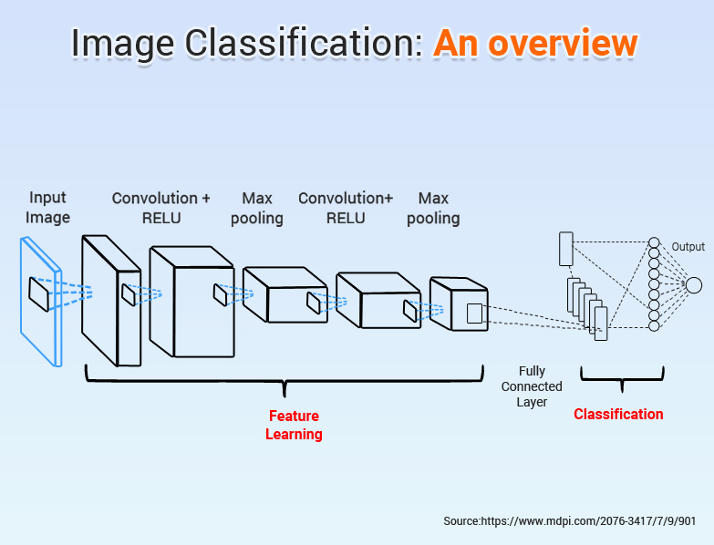

    <h1>Image Classification 💻</h1>

    
p>

**Abstract:** 
Image classification refers to the task of extracting information classes from a multiband raster image. The resulting raster from image classification can be used to create thematic maps. Image Classification is a fundamental task that attempts to comprehend an entire image as a whole. The goal is to classify the image by assigning it to a specific label. Typically, Image Classification refers to images in which only one object appears and is analyzed. In contrast, object detection involves both classification and localization tasks, and is used to analyze more realistic cases in which multiple objects may exist in an image. Depending on the interaction between the analyst and the computer during classification, there are two types of classification: supervised and unsupervised. 

## Types of Classification
There are 2 types of classifications- 

- Supervised classification
Supervised classification uses the spectral signatures obtained from training samples to classify an image. With the assistance of the Image Classification toolbar, you can easily create training samples to represent the classes you want to extract. You can also easily create a signature file from the training samples, which is then used by the multivariate classification tools to classify the image.

- Unsupervised classification
Unsupervised classification finds spectral classes (or clusters) in a multiband image without the analyst’s intervention. The Image Classification toolbar aids in unsupervised classification by providing access to the tools to create the clusters, capability to analyze the quality of the clusters, and access to classification tools.

## Structure of the Projects 📝
This repository consists of various machine learning projects, and all of the projects must follow a certain template. I wish the contributors will take care of this while contributing in this repository.   
**Dataset** - This folder stores the dataset used in this project. If the Dataset is not being able to uploaded in this folder due to the large size, then put a README.md file inside the Dataset folder and put the link of the collected dataset in it. That'll work!  
**Images** - This folder is used to store the images generated during the data analysis, data visualization, data segmentation of the project.  
**Model** - This folder would have your project file (that is .ipynb file) be it analysis or prediction. 

## Resources 📝
https://youtube.com/playlist?list=PLZoTAELRMXVPGU70ZGsckrMdr0FteeRUi&utm_source=EKLEiJECCKjOmKnC5IiRIQ
https://youtube.com/playlist?list=PLZoTAELRMXVPBTrWtJkn3wWQxZkmTXGwe&utm_source=EKLEiJECCKjOmKnC5IiRIQ

## 🧮 Workflow
- Fork the repository
- Clone your forked repository using terminal or gitbash.
- Make changes to the cloned repository
- Add, Commit and Push
- Then in Github, in your cloned repository find the option to make a pull request

## Built with
<code></code>
<code></code>
<code></code>
<code></code>
<code></code>
<code></code>
<code></code>

### © 2022 Arushi Garg- GDSC

## Thank You! Show some :heart: if you like it!
